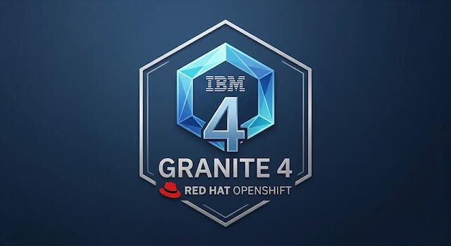

<p align="center">
  
</p>

# OpenShift Lightspeed with a Self-Hosted LLM on OpenShift

A reference architecture for running Red Hat OpenShift
Lightspeed against a self-hosted LLM on Red Hat OpenShift AI, with no
external LLM provider. Built around an SNO cluster with a consumer
NVIDIA GPU (RTX 3060 Ti / 8 GB VRAM).

The default model is **IBM Granite 4.1 3B** — a dense, instruction-tuned
language model released under Apache 2.0. The architecture supports
swapping to any vLLM-compatible model by changing the OCI model image
and a single ServingRuntime arg.

**Not officially supported by Red Hat.** This uses the OLS `openai`
provider type pointing at a self-hosted vLLM ServingRuntime. The
pattern works but is outside the supported provider matrix. For
production use with regulated customers, file a support exception
through your account team.

## What this builds

Three namespaces cooperating. The **model itself** runs in
`llm-serving`. **OpenShift AI** manages it from
`redhat-ods-applications`. The **NVIDIA driver** provides the GPU
from `nvidia-gpu-operator`. And **OpenShift Lightspeed** calls the
model over in-cluster DNS from `openshift-lightspeed`.

```
openshift-lightspeed              llm-serving
────────────────────              ─────────────
lightspeed-app-server  ────HTTP──►  granite-41-3b-predictor (vLLM + Granite 4.1)
                                         │
                                         │ requests nvidia.com/gpu: 1
                                         ▼
                                   [ NVIDIA RTX 3060 Ti ]
                                         ▲
                        ┌────────────────┴────────────────┐
          reconciled by │                                 │ driver from
                        │                                 │
              redhat-ods-applications             nvidia-gpu-operator
              (KServe controller)                 (driver DaemonSet)
```

For a full walkthrough of what runs where, namespace responsibilities,
the end-to-end request path, and what changes at production scale,
see [ARCHITECTURE.md](ARCHITECTURE.md).

## Why Granite 4.1?

This project started with Google Gemma 4. During development, I
discovered that **all Gemma 4 variants use a Mixture-of-Experts (MoE)
architecture** that stores all 128 expert parameter sets in VRAM —
even the "Effective 2B" variant consumes ~9.5 GB. On an 8 GB consumer
GPU, no quantization or offloading strategy fits any Gemma 4 model
via vLLM.

IBM Granite 4.1 3B is a **dense** 3B-parameter model (~6.4 GB in
bf16) that fits on 8 GB VRAM with room for a 4K-token KV cache. It
benchmarks competitively with much larger models on instruction
following and tool calling (see the
[Granite 4.1 blog post](https://research.ibm.com/blog/granite-4-1-ai-foundation-models)),
is Apache 2.0 licensed, and is supported by Red Hat.

For production deployments on larger GPUs (L4, L40S, H100), the same
architecture supports Granite 4.1 8B, 30B, or any model the customer
prefers — only the OCI model image and one `--served-model-name` arg
change.

## Tested hardware example

- Single Node OpenShift 4.21.x
- 12th Gen Intel i9 (or equivalent), 64 GB+ RAM recommended
- NVIDIA RTX 3060 Ti (or any NVIDIA card with 8 GB+ VRAM)
- ~20 GB free on default storage class for model image pull

For a customer pilot, I recommend at least a single or a 3-node compact cluster with an
L4 or L40S GPU worker. The YAML in this bundle changes minimally
between the two — see "Scaling up" at the bottom.

## Two paths: manual or automated

You can apply the manifests by hand (`oc apply -f ...`) or run the
included Ansible playbook that handles everything — including GPU
auto-detection, readiness waits, and a CUDA validation step — in one
command.

- **Manual apply:** see "Apply order" below. Best when you're
  recording a video or learning the pattern step by step.
- **Ansible automation:** see [`ansible/README.md`](ansible/README.md).
  Best for repeat deployments, customer pilots, or when you just want
  the thing built without babysitting it.

Both paths apply the same YAML files. The Ansible playbook uses `oc`
under the hood — no extra Python dependencies, no SSH required.

## Prerequisites (do these first, in this order)

1. **Install operators from OperatorHub** (in the web console):
   - Node Feature Discovery Operator
   - NVIDIA GPU Operator
   - Red Hat OpenShift AI
   - OpenShift Lightspeed

   Wait for each to reach Succeeded before installing the next.

2. **Have a Quay account** at `quay.io` (or update the image
   references in `manifests/05-inferenceservice.yaml` and `build.sh`
   to your own namespace).

3. **Build and push the model image** using `build.sh`. The script
   downloads model weights from Hugging Face, packages them into an
   OCI ModelCar image, and pushes to Quay. See the "Building the
   model image" section below.

## Apply order (manual path)

```bash
# Phase 1: GPU plumbing
oc apply -f manifests/01-nfd.yaml
# Wait ~60s for NFD to label the node, then verify:
oc get nodes -o json | jq '.items[].metadata.labels' | grep 10de
# You should see: "feature.node.kubernetes.io/pci-10de.present": "true"

oc apply -f manifests/02-gpu-clusterpolicy.yaml
# This takes 5-10 min on first apply (driver build). Watch:
oc -n nvidia-gpu-operator get pods -w
# Wait until nvidia-driver-daemonset, nvidia-device-plugin-daemonset,
# and nvidia-operator-validator pods are all Running.

# Validate GPU is visible to pods (CRITICAL — do not skip):
cat <<EOF | oc apply -f -
apiVersion: v1
kind: Pod
metadata:
  name: cuda-vectoradd-test
  namespace: default
spec:
  restartPolicy: OnFailure
  containers:
    - name: cuda-vectoradd
      image: nvcr.io/nvidia/k8s/cuda-sample:vectoradd-cuda11.7.1-ubuntu20.04
      resources:
        limits:
          nvidia.com/gpu: 1
EOF
oc -n default logs cuda-vectoradd-test
# Expected output ends with: "Test PASSED"
oc -n default delete pod cuda-vectoradd-test

# Phase 2: OpenShift AI
oc apply -f manifests/03-dsc.yaml
# Watch the RHOAI pods come up:
oc -n redhat-ods-applications get pods -w
# Wait for kserve-controller-manager and odh-model-controller to be
# Running. Should take 2-3 min.

# Phase 3: Deploy the model
oc apply -f manifests/00-namespace.yaml
oc apply -f manifests/04-servingruntime.yaml
oc apply -f manifests/05-inferenceservice.yaml
# Watch the predictor pod come up:
oc -n llm-serving get pods -w
# First start is slow: KServe pulls the OCI image (~6.4 GB), copies
# model files, vLLM loads the model. Expect 5-10 min.

# SMOKE TEST the model directly before touching OLS:
POD=$(oc get pod -n llm-serving -o jsonpath='{.items[0].metadata.name}')
oc exec -n llm-serving "$POD" -c kserve-container -- \
  curl -s http://localhost:8080/v1/models | python3 -m json.tool
# Should return a model with id "granite-41-3b"

oc exec -n llm-serving "$POD" -c kserve-container -- \
  curl -s -X POST http://localhost:8080/v1/chat/completions \
  -H 'Content-Type: application/json' \
  -d '{
    "model": "granite-41-3b",
    "messages": [{"role": "user", "content": "What is a Kubernetes Deployment in one sentence?"}],
    "max_tokens": 100
  }' | python3 -m json.tool
# Should return a coherent answer. If this fails, OLS will too —
# debug here first.

# Phase 4: Wire OLS
oc apply -f manifests/06-ols-secret.yaml
oc apply -f manifests/07-olsconfig.yaml
oc -n openshift-lightspeed get pods -w
# Wait for lightspeed-app-server to be 2/2 Running.
```

## Building the model image

The model is packaged as an OCI "ModelCar" image — a minimal
container with the model weights at `/models/`. KServe pulls this
image and mounts the weights into the vLLM serving container.

```bash
# Install huggingface_hub if not present
pip install --user huggingface_hub

# Log in to Hugging Face (needed for gated models; Granite 4.1 is
# open but login avoids rate limits)
hf auth login

# Log in to Quay
podman login quay.io

# Build and push
chmod +x build.sh
./build.sh v1
```

The script downloads ~6.4 GB of model weights from Hugging Face,
builds a ~6.4 GB OCI image on top of UBI9-micro, and pushes to Quay.

**Tip:** If pushing from a Mac is slow or unreliable (iCloud competing
for upload bandwidth, podman VM disk limits), push from a RHEL bastion
host instead. `podman` and `skopeo` on RHEL run natively without a VM
and push reliably over wired connections.

## Apply order (Ansible path)

```bash
cd ansible/
pip install --user ansible-core
oc login ...                                    # log in to target cluster
ansible-playbook -i inventory/hosts.ini deploy.yml
```

That's it. The playbook runs every step above — including GPU
detection via `oc debug node`, readiness waits, and the CUDA
validation pod — as a single idempotent run. See
[`ansible/README.md`](ansible/README.md) for tags, troubleshooting,
and teardown instructions.

## Demo: ask OLS a question

1. In the OCP web console, click the Lightspeed sparkle icon
   (top-right corner).
2. Ask: "How do I create a PersistentVolumeClaim with the LVM storage
   class?"
3. In a side terminal:
   `oc -n llm-serving logs -f deployment/granite-41-3b-predictor`
   You'll see the request hit and tokens stream back.

## Swapping models

The architecture is model-agnostic. To swap in a different model:

1. Update `MODEL_ID` and `IMAGE_REPO` in `build.sh`.
2. Run `./build.sh v1` to download, build, and push.
3. Update `storageUri` in `manifests/05-inferenceservice.yaml`.
4. Update `--served-model-name` in `manifests/04-servingruntime.yaml`.
5. Update `models[].name` in `manifests/07-olsconfig.yaml`.
6. Adjust vLLM args (`--max-model-len`, `--gpu-memory-utilization`,
   etc.) based on the model's size and your GPU's VRAM.
7. `oc apply` the updated manifests.

Models tested or considered during development:

| Model | Type | Size (bf16) | Fits 8 GB? | Notes |
|---|---|---|---|---|
| **Granite 4.1 3B** | Dense | 6.4 GB | ✅ Yes | Current default. Best quality-to-size for 8 GB |
| Gemma 4 E4B | MoE | ~15 GB total | ❌ No | "Effective 4B" but MoE stores all experts in VRAM |
| Gemma 4 E2B | MoE | ~9.5 GB total | ❌ No | Same MoE trap as E4B |
| Granite 4.1 8B | Dense | ~16 GB | ❌ No | Great for L4/L40S production deployments |
| Llama 3.2 3B | Dense | ~6 GB | ✅ Yes | Alternative; Meta Community License |

## Troubleshooting matrix

| Symptom | Likely cause | Fix |
|---|---|---|
| `nvidia-driver-daemonset` CrashLoop | Driver version doesn't support your GPU | Pin `driver.version` in `manifests/02-gpu-clusterpolicy.yaml` to a known-good build (e.g. `550.90.07`) and re-apply |
| `cuda-vectoradd-test` pod fails | GPU Operator not fully ready | Wait longer; check `nvidia-operator-validator` logs |
| Predictor pod stuck `Init` | OCI image pull slow or repo private | Check `oc describe pod` for image pull progress; make Quay repo public |
| vLLM CrashLoop with CUDA OOM | Model too large for GPU | Lower `--max-model-len` and `--gpu-memory-utilization`, or use a smaller model |
| vLLM CrashLoop with KV cache error | `max-model-len` exceeds available KV cache | Reduce `--max-model-len` or increase `--gpu-memory-utilization` |
| OLS "prompt exceeds maximum token limit" | Context window too small for OLS system prompt | Increase `--max-model-len` to 8192+ |
| OLS "Connection error" to predictor | Port mismatch or service name wrong | Verify OLSConfig URL includes `:8080` and matches `oc get svc -n llm-serving` |
| OLS pod can't reach predictor | Wrong service name/URL | Verify with `oc -n llm-serving get svc`; the service is `<isvc-name>-predictor` in RawDeployment mode |
| Old ReplicaSet deadlocks new deployment | Rolling update can't schedule (GPU contention) | `oc scale replicaset -n llm-serving <old-rs> --replicas=0` then delete old pod |

## Scaling up: from SNO/3060 Ti to L4/L40S pilot

The OLSConfig is identical between homelab and pilot. Only three
things change:

1. **Model size**: Build a new OCI image with a larger model
   (e.g. `ibm-granite/granite-4.1-8b` or `ibm-granite/granite-4.1-30b`).
   Update `storageUri` in `manifests/05-inferenceservice.yaml`.

2. **vLLM args**: Drop `--enforce-eager`, raise `--max-model-len` to
   32768 or higher, raise `--max-num-seqs` to 16-32 for real
   concurrency. Raise memory limit to 64 Gi.

3. **DSC**: Switch `kserve.defaultDeploymentMode` from `RawDeployment`
   to `Serverless` if the customer wants scale-to-zero. Costs
   Knative + Istio overhead but is the more "enterprise" pattern.

That's it. The OLSConfig (`manifests/07-olsconfig.yaml`) doesn't
change at all.

## Repository layout

```
.
├── manifests/
│   ├── 00-namespace.yaml ........ llm-serving namespace
│   ├── 01-nfd.yaml .............. NodeFeatureDiscovery instance
│   ├── 02-gpu-clusterpolicy.yaml  NVIDIA GPU Operator config
│   ├── 03-dsc.yaml .............. RHOAI DataScienceCluster (trimmed for SNO)
│   ├── 04-servingruntime.yaml ... vLLM ServingRuntime (Granite 4.1 compatible)
│   ├── 05-inferenceservice.yaml . Granite 4.1 3B InferenceService
│   ├── 06-ols-secret.yaml ....... Placeholder OLS credentials secret
│   └── 07-olsconfig.yaml ........ OLSConfig pointing at the KServe predictor
├── ansible/
│   ├── deploy.yml ............... Full deployment playbook (oc-based)
│   ├── teardown.yml ............. Remove all CRs created by deploy.yml
│   ├── README.md ................ Ansible-specific docs
│   ├── inventory/hosts.ini ...... Localhost-only inventory
│   └── group_vars/all.yml ....... Timeouts, GPU ID table, manifests dir
├── .github/workflows/
│   └── build-model-image.yml .... CI/CD: build and push model image to Quay
├── images/
│   └── logo.jpg ................. Project logo
├── Containerfile ................ OCI ModelCar image definition
├── build.sh ..................... HF download + image build + Quay push
├── ARCHITECTURE.md .............. Namespace and component architecture
├── .gitignore
└── README.md .................... This file
```

## CI/CD

The repo includes a GitHub Actions workflow at
`.github/workflows/build-model-image.yml` that rebuilds the model
OCI image and pushes it to Quay. It runs on manual dispatch (with a
user-supplied tag) and automatically on changes to `Containerfile` or
`build.sh`.

To enable it, configure three secrets in your GitHub repo
(Settings → Secrets and variables → Actions):

| Secret | What it is |
|---|---|
| `HF_TOKEN` | Hugging Face access token |
| `QUAY_USERNAME` | Quay robot account name (e.g. `ryan_nix+github_actions`) |
| `QUAY_TOKEN` | Quay robot account password |

Use a **robot account**, not your personal Quay credentials — scope
the robot to write access on just the model image repository.

## Disclaimer

The projects and opinions in this repository are Ryan's own and are
not official Red Hat positions or products.
